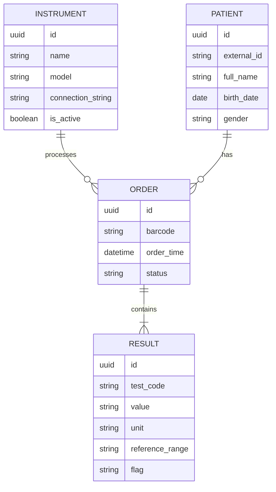

# 🔬 LIS Middleware - Tam Texniki Tapşırıq (SRS)
## Versiya: 1.0 | Status: Layihələndirmə 🏗️

Bu sənəd laboratoriya cihazlarından məlumatların tam avtomatlaşdırılmış şəkildə toplanması, emalı və vizuallaşdırılması sisteminin qurulması üçün rəsmi texniki bələdçidir.

---

## 1. 🏗️ Sistem Arxitekturası (High-Level)
Sistem **Clean Architecture** prinsipləri əsasında 4 laylı strukturda qurulacaq:

1.  **Domain:** Entity-lər (Patient, Test, Result) və interface-lər.
2.  **Application:** Business Logics (ASTM parsing logic, Validation).
3.  **Infrastructure:** External services (Serial Port Listener, Database context, TCP Listener).
4.  **Presentation (Web API):** React üçün REST endpoint-lər və SignalR Hub-lar.

---

## 2. 🔌 Kommunikasiya Protokolları

### 2.1. Physical Layer (ASTM E1381) 📡
Cihazlarla əlaqə iki növ ola bilər:
- **Serial (RS232):** `9600-115200 baud`, `8 bits`, `No parity`, `1 stop bit`.
- **TCP/IP:** Cihaz serverə IP vasitəsilə qoşulur (Port 5000+).

#### ASTM State Machine (Əlaqə Alqoritmi):
1.  **Establishment:** Host (Biz) <--- `ENQ` (Enquiry) --- Analizator
2.  **Response:** Host --- `ACK` (Acknowledge) ---> Analizator
3.  **Transfer:** Analizator --- `STX` [Data] `ETX` [Checksum] ---> Host
4.  **Confirm:** Host --- `ACK` ---> Analizator
5.  **Termination:** Analizator --- `EOT` (End of Transmission) ---> Host

### 2.2. Logical Layer (ASTM E1394) 📜
Gələn mesaj sətirləri (Segments) aşağıdakı formatda parçalanacaq:
- **H (Header):** Göndərən cihaz (məs: *Cobas e411*).
- **P (Patient):** Xəstənin unikal kodu və demoqrafik məlumatları.
- **O (Order):** Sifariş növü (məs: *Glucose, Vitamin D3*).
- **R (Result):** Analiz göstəricisi, dəyəri, vahidi (məs: *105 | mg/dL*).
- **T (Terminator):** Mesajın tam bitdiyini bildirir.

---

## 3. 💾 Verilənlər Bazası Modeli (PostgreSQL)

---

## 4. 💻 Backend Tələbləri (C# .NET 8)
- **Background Workers:** Hər bir cihaz üçün ayrıca `Worker Service` çalışmalı və portu daimi dinləməlidir.
- **Parser Engine:** `Regex` və ya `String Split` vasitəsilə ASTM sətirlərini obyektlərə çevirməlidir.
- **Concurrency:** Çox sayda cihazdan eyni anda gələn məlumatları asinxron (`Task`) idarə etməlidir.
- **Logging:** Hər bir `raw message` (xam məlumat) `Logs/Raw` qovluğunda və ya bazada saxlanılmalıdır (Debugging üçün).

---

## 5. 🎨 Frontend Tələbləri (React)
- **Real-time Dashboard:** SignalR vasitəsilə analizlər dərhal ekranda görünməli (Yeniləmə düyməsinə basmadan).
- **Adaptive Layout:** Həm böyük monitorlarda, həm də həkimlərin planşetlərində rahat görünməlidir.
- **Visual Indicators:** Normaldan kənar nəticələr (High/Low) qırmızı/sarı rənglərlə dərhal seçilməlidir.
- **Search & Filters:** Tarix aralığı, xəstə adı və cihaz üzrə filtrasiya.

---

## 🛡️ Təhlükəsizlik və Keyfiyyət
1.  **Data Integrity:** ASTM Checksum-ları mütləq yoxlanılmalıdır. Yanlış gələn məlumat bazaya yazılmamalıdır.
2.  **Auth:** Host sistemə daxil olmaq üçün JWT-based autentifikasiya.
3.  **Audit Trail:** Kim nə vaxt hansı analizi portdan qəbul etdi - qeydiyyatı.

---

## 🗓️ Yol Xəritəsi (Roadmap)
- [ ] **Həftə 1:** ASTM Parser və Serial Port Listener-in testi.
- [ ] **Həftə 2:** PostgreSQL sxeminin qurulması və Web API.
- [ ] **Həftə 3:** React Dashboard və SignalR inteqrasiyası.
- [ ] **Həftə 4:** Cihazlarla real test və Pilot işəsalma.
